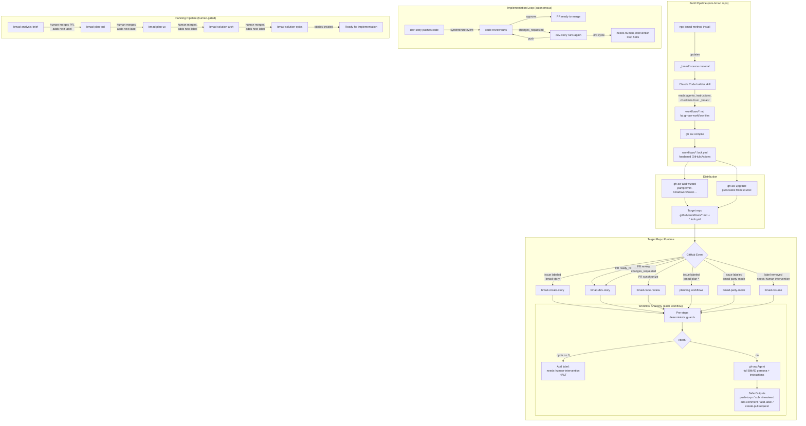
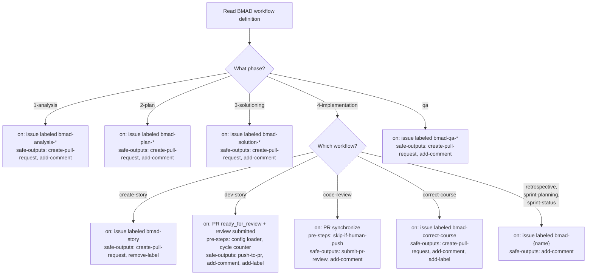

# mm-bmad v2 Design Document

## Project Identity

**Project:** mm-bmad v2
**One-liner:** A build pipeline that compiles the BMAD methodology into native GitHub Agentic Workflows.

**What it is:**

- A repo containing BMAD source material (`_bmad/`) and a Claude Code builder skill
- The builder reads BMAD agent definitions, workflow instructions, and checklists, then generates self-contained gh-aw `.md` files
- Target repos install workflows via `gh aw add-wizard` — no BMAD knowledge required
- When upstream BMAD updates, re-run `npx bmad-method install` + the builder to regenerate workflows

**What it is NOT:**

- Not a runtime wrapper or proxy
- Not a centralized agent brain that caller repos depend on at execution time
- Not a replacement for BMAD — it is a compiler from BMAD to gh-aw

---

## Architecture Overview

### The Build Pipeline



### Key Design Principles

- **Labels are the state machine.** Not LLM self-reporting. Deterministic, queryable, visible in the GitHub UI.
- **Pre-steps handle deterministic logic.** Counting review cycles, reading config, aborting on circuit breakers. Never ask the LLM to count.
- **Safe-outputs are the only write path.** The agent cannot bypass them. This is real enforcement via gh-aw's security model.
- **One agent per workflow, but that agent can embody multiple perspectives.** Multi-agent discussion (party mode) does not need separate LLM invocations.
- **GitHub's event bus is the only coupling between workflows.** No workflow references another by name. Push events trigger reviews. Review events trigger dev fixes. Labels trigger planning stages.

---

## Event-Driven State Machine

### Label Conventions

**Trigger labels** follow the pattern `bmad-{phase}-{workflow}`. The exact set is discovered by the builder skill from `_bmad/bmm/workflows/` at build time.

**State labels** (control flow, not triggers):

| Label | Purpose |
|---|---|
| `needs-human-intervention` | Circuit breaker — all workflows skip when present |
| `bmad-consensus` | Party mode reached a decision |

### Event-Triggered Workflows (no label needed)

| Workflow | Trigger |
|----------|---------|
| dev-story | PR `ready_for_review` or `pull_request_review: changes_requested` |
| code-review | PR `synchronize` (push to PR branch) |
| resume | `needs-human-intervention` label removed, or human comment on blocked item |

### The Implementation Loop (Autonomous)

```
dev-story agent finishes
    ├── safe-output: push-to-pr
    └── GitHub fires "synchronize" event on the PR
            ↓
code-review agent runs
    ├── safe-output: submit-pr-review (approve) → done
    └── safe-output: submit-pr-review (changes_requested)
            ↓
        GitHub fires "pull_request_review submitted" event
            ↓
dev-story agent runs again
    ├── pre-step: count review cycles (deterministic shell)
    ├── if cycles >= 3: add label needs-human-intervention, exit
    └── otherwise: read review comments, fix, push-to-pr
            ↓
        ... loop continues until approved or halted ...
```

### The Planning Pipeline (Human-Gated)

Each planning workflow creates a PR with its artifact. The human reviews, merges, then adds the next label to trigger the next phase. Planning decisions are not fully autonomous.

### Human-in-the-Loop Mechanisms

**Blocker Protocol:** When an agent cannot proceed, it uses safe-outputs to `add-comment` (explaining what it needs) and `add-label` (`needs-human-intervention`). All workflows have an `if:` guard that skips execution when this label is present. The loop resumes when a human removes the label.

**3-Strike Rule:** Implemented as a deterministic pre-step, not LLM self-reporting:

```yaml
steps:
  - name: Count review cycles
    id: guard
    run: |
      CYCLES=$(gh pr view $PR --json reviews \
        --jq '[.reviews[] | select(.state == "CHANGES_REQUESTED")] | length')
      if [ "$CYCLES" -ge 3 ]; then
        gh pr comment $PR --body "3 review cycles reached. Halting."
        gh pr edit $PR --add-label "needs-human-intervention"
        exit 1
      fi
```

**Slash Commands:** For lightweight human micro-decisions without full halts. `/choose A`, `/approve`, `/skip-review`.

---

## Workflow Anatomy

Every generated workflow follows the same structure. The builder produces self-contained "fat" `.md` files — everything the agent needs is embedded.

### Structural Template

```markdown
---
description: "BMAD {Workflow Name} ({Agent Name}) — {one-line purpose}"
source: jcampb/mm-bmad/workflows/bmad-{name}@main

on:
  {trigger configuration}

engine: claude
timeout-minutes: 30

permissions:
  {minimal required permissions}

tools:
  github:
    toolsets: [{required toolsets}]

steps:
  - name: Read project config
    id: config
    run: |
      if [ -f .bmad/config.yaml ]; then
        cat .bmad/config.yaml >> $GITHUB_OUTPUT
      fi

  {additional deterministic pre-steps as needed}

safe-outputs:
  {only the outputs this workflow needs}
---

# BMAD {Workflow Name} Agent

## Your Persona
{From agent.yaml: role, identity, communication_style}

## Principles
{From agent.yaml: persona.principles}

## Critical Rules
{From agent.yaml: critical_actions}

## Instructions
{Translated from workflow instructions.xml or workflow.md}

## Checklist
{From workflow checklist.md}

## Guardrails
{Standard blocker protocol + scope constraints}
```

### Multi-Perspective Workflows

When multiple BMAD agents map to the same workflow (discovered from the `menu` field in agent YAML files), the converter produces a multi-perspective workflow:

```markdown
## Your Perspectives
You are performing a multi-perspective analysis. Evaluate through
each lens sequentially:

### {Agent 1 Title} Lens ({Agent 1 Name})
Role: {from agent.yaml}
Style: {from agent.yaml}
Focus: {derived from agent capabilities and principles}

### {Agent 2 Title} Lens ({Agent 2 Name})
Role: {from agent.yaml}
Style: {from agent.yaml}
Focus: {derived from agent capabilities and principles}

## Instructions
1. Evaluate through each perspective
2. Synthesize: identify gaps, conflicts, missing alignment
3. Post structured analysis as a single comment
```

### Frontmatter Decision Tree

The builder determines frontmatter based on the workflow's phase and type:



---

## The Builder

### Decomposition

Two files with clear separation of concerns:

**`.claude/skills/bmad-build-workflows.md`** — The orchestrator. Knows the system-level architecture, does not know how to convert individual files. Responsibilities:

1. Read `_bmad/bmm/workflows/` directory structure to discover all workflows
2. Read ALL `_bmad/bmm/agents/*.agent.yaml` files
3. Parse each agent's `menu` field to build a reverse map: `workflow path → owning agent(s)`
4. Present the user with which workflows to regenerate (all or pick specific ones)
5. For each selected workflow, determine:
   - Phase (analysis, plan, solutioning, implementation, qa)
   - Trigger pattern (label-triggered, event-triggered, slash-command)
   - Required safe-outputs based on the frontmatter decision tree
   - Required pre-steps (cycle counter for dev-story, config loader, etc.)
   - Owning agent(s) — single agent or multi-perspective
6. Launch a converter subagent for each workflow with focused inputs
7. Evaluate each subagent's output against quality checks
8. Review all outputs for cross-workflow consistency
9. Present each generated workflow to the user for approval
10. Write approved files to `workflows/`

**`.claude/skills/bmad-converter-prompt.md`** — The converter. Knows how to translate one BMAD workflow + its owning agent(s) into one gh-aw file. Tight, focused, ~200 lines. Receives from the orchestrator:

```
Inputs:
  phase: "4-implementation"
  workflow: "dev-story"
  trigger_pattern: "pr_review_cycle"
  safe_outputs: ["push-to-pr", "add-comment", "add-label"]
  pre_steps: ["config-loader", "cycle-counter"]

  workflow_source:
    instructions: "_bmad/bmm/workflows/4-implementation/dev-story/workflow.yaml"
    checklist: "_bmad/bmm/workflows/4-implementation/dev-story/checklist.md"

  agent_definitions:              # single or multiple
    - name: "Amelia"
      title: "Developer Agent"
      role: "Senior Software Engineer"
      identity: "Executes approved stories with strict adherence..."
      communication_style: "Ultra-succinct. Speaks in file paths and AC IDs..."
      principles: [...]
      critical_actions: [...]
      capabilities: "story execution, test-driven development, code implementation"
```

### Converter Translation Rules

| BMAD Source | gh-aw Output |
|---|---|
| `agent.persona.role` + `identity` + `communication_style` | `## Your Persona` section (single agent) or `## Your Perspectives` section (multiple agents) |
| `agent.persona.principles` | `## Principles` section |
| `agent.critical_actions` | `## Critical Rules` section |
| `agent.metadata.capabilities` | Informs `tools:` selection in frontmatter |
| `workflow/instructions.xml` or `workflow.md` | `## Instructions` section, translated to markdown |
| `workflow/checklist.md` | `## Checklist` section |
| "Ask user for clarification" patterns | Blocker protocol: `add-comment` + `add-label: needs-human-intervention` |
| Sequential pipeline (A then B) | Human-gated: each creates a PR, human merges and labels next |
| Autonomous loop (dev ↔ review) | Event-driven: push triggers review, changes_requested triggers dev |
| Multiple owning agents | Single workflow with multi-perspective prompt |

### Builder Evaluation Checks

After each converter subagent returns, the orchestrator validates:

**Structural checks (deterministic):**

| Check | Rule |
|---|---|
| Frontmatter present | File starts with `---` and has valid YAML frontmatter |
| Required frontmatter fields | `on:`, `engine: claude`, `permissions:`, `tools:`, `safe-outputs:` all present |
| `source:` field set | Must be `jcampb/mm-bmad/workflows/{filename}@main` |
| Safe-outputs match phase pattern | Implementation workflows have `push-to-pr`, planning workflows have `create-pull-request` |
| `needs-human-intervention` guard | Every workflow skips when this label is present |
| Pre-steps present where required | dev-story has cycle counter, all workflows have config loader |
| Label naming convention | Trigger labels match `bmad-{phase}-{workflow}` pattern |

**Content checks (semantic):**

| Check | Rule |
|---|---|
| All BMAD instructions translated | No instruction steps from the source were dropped or summarized |
| Checklist is complete | Every item from the BMAD checklist appears |
| Persona is specific | Has the BMAD agent's actual name, role, communication style — not generic |
| Critical actions preserved | Every critical_action from the agent YAML appears in Critical Rules |
| Guardrails present | Blocker protocol section exists with exact `add-comment` + `add-label` pattern |
| No cross-workflow knowledge | Workflow doesn't reference other workflows by name |
| No raw write operations | Instructions never say "commit" or "push" directly — always through safe-outputs |
| Scope constraints present | Instructions include boundaries on what files/areas the agent can modify |

**Cross-workflow checks (after all subagents complete):**

| Check | Rule |
|---|---|
| No duplicate trigger labels | Two workflows don't trigger on the same label |
| Persona voice consistency | All workflows use consistent tone/style conventions |
| Guardrail consistency | Blocker protocol wording is identical across all workflows |
| Label vocabulary closed | Every label in `add-label`/`remove-label` safe-outputs is a known trigger or state label |

**On failure:** The orchestrator flags the specific failure, re-runs that one subagent with the failure as additional context (one retry). If the retry also fails, it presents both attempts to the user to choose or manually edit.

---

## Target Repo Setup & Distribution

### Installation

From any target repo:

```bash
# 1. Install the workflows you want
gh aw add-wizard jcampb/mm-bmad/workflows/bmad-create-story
gh aw add-wizard jcampb/mm-bmad/workflows/bmad-dev-story
gh aw add-wizard jcampb/mm-bmad/workflows/bmad-code-review
# ... pick whichever workflows apply

# 2. Compile
gh aw compile

# 3. Optionally add project config
mkdir -p .bmad
cat > .bmad/config.yaml << 'EOF'
language: TypeScript
framework: Next.js
test_runner: vitest
skill_level: senior
project_type: web-app
EOF

# 4. Commit and push
git add .github/workflows/ .bmad/
git commit -m "Add BMAD workflows"
git push

# 5. Done. Start using by adding labels to issues.
```

### What Lands in the Target Repo

```
target-project/
├── .github/
│   └── workflows/
│       ├── bmad-create-story.md        # source (from mm-bmad)
│       ├── bmad-create-story.lock.yml  # compiled (gh aw compile)
│       ├── bmad-dev-story.md
│       ├── bmad-dev-story.lock.yml
│       ├── bmad-code-review.md
│       ├── bmad-code-review.lock.yml
│       └── ... (only the workflows they chose)
├── .bmad/
│   └── config.yaml                     # optional project config
└── (their project files)
```

### Requirements

- **No PAT needed.** The `workflows/` directory in mm-bmad is public.
- Target repo needs its own `ANTHROPIC_API_KEY` secret (for the Claude engine).
- No `_bmad/` directory needed in the target repo.
- No BMAD-METHOD installation needed in the target repo.
- No knowledge of BMAD internals required.

### Updating

```bash
gh aw upgrade    # pulls latest from source: field in each workflow's frontmatter
gh aw compile    # recompiles
git add .github/workflows/ && git commit -m "Upgrade BMAD workflows"
```

### .bmad/config.yaml Schema

Optional but recommended. If absent, workflows auto-detect from repo files.

```yaml
language: TypeScript          # optional, auto-detected if missing
framework: Next.js            # optional
test_runner: vitest           # optional, auto-detected if missing
skill_level: senior           # senior | mid | junior — affects verbosity
project_type: web-app         # optional, helps agent understand context
```

---

## Repo Structure (mm-bmad v2)

```
mm-bmad/
├── _bmad/                              # BMAD source (committed, private input)
│   └── bmm/
│       ├── config.yaml
│       ├── agents/
│       │   ├── analyst.agent.yaml
│       │   ├── architect.agent.yaml
│       │   ├── dev.agent.yaml
│       │   ├── pm.agent.yaml
│       │   ├── qa.agent.yaml
│       │   ├── sm.agent.yaml
│       │   ├── ux-designer.agent.yaml
│       │   ├── quick-flow-solo-dev.agent.yaml
│       │   └── tech-writer/
│       └── workflows/
│           ├── 1-analysis/
│           ├── 2-plan-workflows/
│           ├── 3-solutioning/
│           ├── 4-implementation/
│           ├── qa-generate-e2e-tests/
│           ├── bmad-quick-flow/
│           ├── document-project/
│           └── generate-project-context/
├── workflows/                          # gh-aw output (public, distributable)
│   ├── bmad-dev-story.md
│   ├── bmad-code-review.md
│   ├── bmad-create-story.md
│   ├── bmad-create-prd.md
│   ├── bmad-create-ux-design.md
│   ├── bmad-create-architecture.md
│   ├── bmad-create-epics.md
│   ├── bmad-correct-course.md
│   ├── bmad-qa-automate.md
│   ├── bmad-party-mode.md
│   ├── bmad-resume.md
│   └── ... (one per BMAD workflow)
├── .claude/
│   └── skills/
│       ├── bmad-build-workflows.md     # orchestrator skill
│       └── bmad-converter-prompt.md    # converter prompt
├── docs/
│   ├── architecture.md
│   └── plans/
│       └── 2026-02-22-mm-bmad-v2-design.md
└── README.md
```

---

## Migration from v1

### What Gets Deleted

Everything from v1:

```
.github/workflows/          # raw YAML workflows (replaced by gh-aw .md + .lock.yml)
agents/                     # old agent prompts (replaced by builder output)
architecture/               # old design doc (replaced by docs/)
examples/                   # caller workflow examples (replaced by gh aw add-wizard)
```

### What Gets Created

```
_bmad/                      # npx bmad-method install
workflows/                  # builder output
.claude/skills/             # builder skill + converter prompt
docs/                       # new architecture and design docs
README.md                   # rewritten for v2
```

### Migration Steps

1. Install BMAD into the repo: `npx bmad-method install`
2. Commit `_bmad/` as source material
3. Create the builder skill files
4. Run the builder to generate all workflows
5. Run `gh aw compile` on generated workflows
6. Delete old `agents/`, `.github/workflows/`, `architecture/`, `examples/`
7. Rewrite README
8. Commit as a clean v2

No backward compatibility needed. The repo has 3 commits and no external consumers.

---

## Decisions Log

| Decision | Choice | Rationale |
|---|---|---|
| v1 wrapper pattern | Abandoned | Bypasses gh-aw security model, sed no-op, universal wrapper not actually universal |
| Approach | Fat workflows (Approach A) | Self-contained, debuggable, simple to distribute. Builder does heavy lifting at build time. |
| AI engine | Claude | Agent prompts designed for Claude's strengths. Configured via `engine: claude` in frontmatter. |
| BMAD relationship | Build-time compilation | `_bmad/` is source input, `workflows/` is compiled output. Re-run builder on BMAD updates. |
| BMAD source committed | Yes | Full traceability of which BMAD version workflows were built from. |
| Target repo setup | Optional `.bmad/config.yaml` | Self-contained workflows with sensible defaults. Config for customization. |
| Builder architecture | Orchestrator skill + converter prompt | Orchestrator knows the system. Converter subagents have tight, focused context per workflow. |
| Loop prevention | Deterministic pre-steps | Shell script counts review cycles, not LLM self-reporting. |
| Party mode | Single-agent multi-perspective | One workflow, structured perspective sections. No comment loops. |
| Planning pipeline | Human-gated | Each stage creates a PR. Human merges and labels next stage. |
| Implementation loop | Autonomous with circuit breaker | Event-driven dev ↔ review cycle. 3-strike pre-step halts to human. |
| Distribution | Public workflows/ directory | No PAT needed. `gh aw add-wizard` and `gh aw upgrade` handle install and updates. |
| Agent definitions | Full incorporation | Agent persona, principles, critical_actions, and capabilities all embedded in generated workflows. |
| Multi-agent workflows | Multi-perspective pattern | When multiple agents own a workflow, converter builds structured perspective sections. |
